# System design
FastAPI serves a same-origin desktop UI and JSON REST API. SQLAlchemy manages transactions and portable SQLite/PostgreSQL data types. Alembic versions the schema. Plain JS modules and local CSS avoid a Node build requirement. Python standard-library scrypt hashes passwords; opaque session tokens are stored hashed in the database. A browser receives an HttpOnly SameSite=Strict cookie; writes require a session-bound CSRF header. API clients may instead send the returned bearer token.

```mermaid
flowchart TD
 UI[Desktop browser] --> API[FastAPI routes and Pydantic]
 API --> AUTH[Authentication and role checks]
 API --> SVC[Trip and reporting services]
 AUTH --> DB[(SQL database)]
 SVC --> REPO[Repository queries]
 REPO --> DB
 SVC --> AUDIT[Audit and correction history]
 AUDIT --> DB
```

## Responsibilities
- api: input/output, authentication dependencies, status codes.
- schemas: bounded validated request models, rejecting extra properties.
- services: lifecycle, identity, metrics, exceptions, master-data policies, audit.
- repositories: persistence queries and safe public serializers.
- models/database: constraints, foreign keys, sessions and migrations.
- static/templates: role-specific desktop views, forms, timeline, reports.

## Data and authentication flow
Login verifies an active account and scrypt hash; throttles repeated failures. A random token's SHA-256 hash, CSRF secret and expiry are persisted. Browser cookie and memory-only CSRF are issued. Each request rechecks user activity/role; logout revokes session. Admin password/role changes revoke existing sessions. Client sends JSON → schema validation → permission checks → service transaction → audit + data commit → response. No direct client database access.

## Trip and event lifecycle
Admin creates scheduled trip with driver, truck and reverse routes; snapshots expected/tolerance and route labels. Driver enters truck code → identification endpoint returns assigned truck/driver/route → driver confirms next event with code → service validates assignment and ordering → timestamps event → updates trip state → releases active-resource uniqueness on completion. Unique (trip,event_type) blocks duplicate punches; partial unique indexes prevent two open trips per resource.

Admin corrects an existing event by appending a correction with effective previous time, new time, actor and reason. All originals remain immutable. Chronological consistency is revalidated against the effective timeline. Admin may append the missing next event using correction mode, with a required reason. Analytics always derive from effective timestamps; past values remain in audit history.

## Extensibility and limits
Generic event names plus directional route snapshots remove Noida/Delhi code coupling. Verification method and evidence fields support future trusted adapters. New maintenance/fuel/document modules can reference truck_id. No event implies GPS verification; optional coordinates and device time are untrusted client evidence. Local app alerts require the server running and a management screen open; not background SMS. Database administrators can modify the physical database; application append-only history is not a cryptographically tamper-proof ledger.

## Incremental plan
1. Freeze requirements/design and explicit assumptions.
2. Foundation/schema/migrations; verify connection and constraints.
3. Authentication/master data; verify role boundaries and invalid inputs.
4. Event lifecycle/identity/corrections; verify sequences, duplicates, inactive resources.
5. Time engine/delay/reports; verify tolerance boundaries and historical aggregates.
6. Desktop UI; exercise three roles in a real browser.
7. Seed demo history, exact Windows/macOS/Linux setup, test evidence, package.

## Technical references
- https://fastapi.tiangolo.com/deployment/manually/ — FastAPI/Uvicorn process setup.
- https://docs.sqlalchemy.org/en/20/dialects/sqlite.html — enable SQLite foreign-key enforcement on connections.
