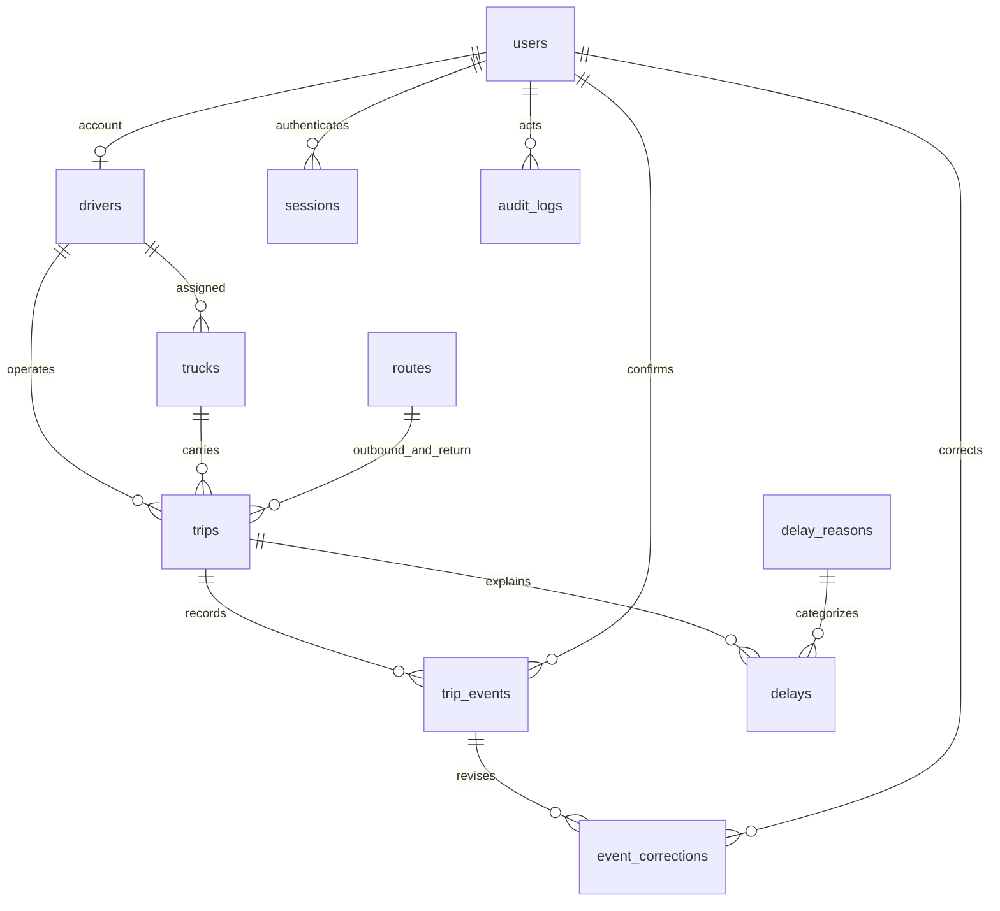

# Database design
The executable initial schema is migrations/versions/0001_initial.py, frozen independently from app/models/entities.py. Run `python -m alembic upgrade head` before initialization. SQLite foreign keys are enabled on every connection. SQLAlchemy types and partial-index predicates support SQLite and PostgreSQL. PostgreSQL execution has not been verified in this environment.

| Table | Columns beyond common identity/timestamps | Keys, constraints and indexes |
|---|---|---|
|users|name, username, password_hash, role, is_active|PK id; unique username; ADMIN/DIRECTOR/DRIVER role check|
|drivers|user_id, employee_id, name, phone, status|PK id; unique user FK and employee_id; ACTIVE/INACTIVE check|
|trucks|registration_number, truck_code, truck_type, capacity, status, assigned_driver_id|PK id; unique registration/code; driver FK nullable; nonnegative capacity; status check|
|routes|origin, destination, expected_duration_minutes, allowed_delay_minutes, is_active|PK id; distinct locations; expected >0, tolerance >=0|
|trips|trip_number, truck_id, driver_id, route_id, return_route_id, trip_date, scheduled_departure, status, origin, destination, outbound_expected, outbound_tolerance, return_expected, return_tolerance|PK id; truck/driver/two route FKs; unique trip_number; indexed trip_date and resource FKs; unique active truck and active driver partial indexes|
|trip_events|trip_id, event_type, event_time, latitude, longitude, verification_method, truck_identity, source, device_id, device_time, correction_reason, created_by|PK id; trip/user FKs; indexed trip_id; unique (trip_id,event_type); coordinate bounds|
|event_corrections|event_id, old_time, new_time, reason, corrected_by, revision|PK id; event/user FKs; indexed event_id; unique(event_id,revision) prevents concurrent correction version collisions|
|delays|trip_id, route_segment, delay_minutes, reason_id, remarks, reported_by|PK id; trip/reason/user FKs; indexed trip_id; unique (trip_id,route_segment); OUTBOUND/RETURN check|
|delay_reasons|name, description, is_active|PK id; unique name|
|audit_logs|user_id, action, entity_type, entity_id, old_value JSON, new_value JSON, timestamp, ip_device|PK id; nullable user FK; indexed entity_id; append-only through application|
|sessions|user_id, token_hash, csrf, expires_at|PK id; indexed user FK; unique SHA-256 token hash; no plaintext token stored|
|login_attempts|key, timestamp|PK id; indexed hashed client key and timestamp; cleaned after 15 minutes|
|settings|significant_delay_minutes, start_grace_minutes, missing_punch_grace_minutes, destination_dwell_minutes, max_open_minutes|Singleton PK id=1; bounded positive validation through API|

Common operational records use integer id, UTC created_at and updated_at. Audit, session, login-attempt and settings tables use their explicitly listed time fields instead.

## Integrity rules
Trip snapshots fix directional timing and place labels at scheduling. Open-trip partial indexes use status NOT IN ('COMPLETED','CANCELLED'). Application locks resources on PostgreSQL; database uniqueness is the final concurrency guard. Each normal event is inserted exactly once. Corrections use incrementing revision plus unique constraint, retain originals and revalidate effective chronology. If a conflict occurs, the transaction rolls back, including its audit entry.

No API physically deletes operational data. DELETE on master resources means deactivate. Open-trip master records cannot be edited or deactivated until the trip is completed or an unstarted trip is cancelled. Events, corrections and audit records have no update/delete endpoints. Admin correction times must be timezone-aware, not in the future, and ordered against neighboring events.

## Backups
For the default local database, stop Uvicorn, then copy trucktrack.db to a safe location. Restore only while the server is stopped. Run migrations and `/health` after restoring. PostgreSQL backup/restore should use pg_dump/pg_restore with your environment's credentials and retention policy. A real restore drill is required before production reliance.
